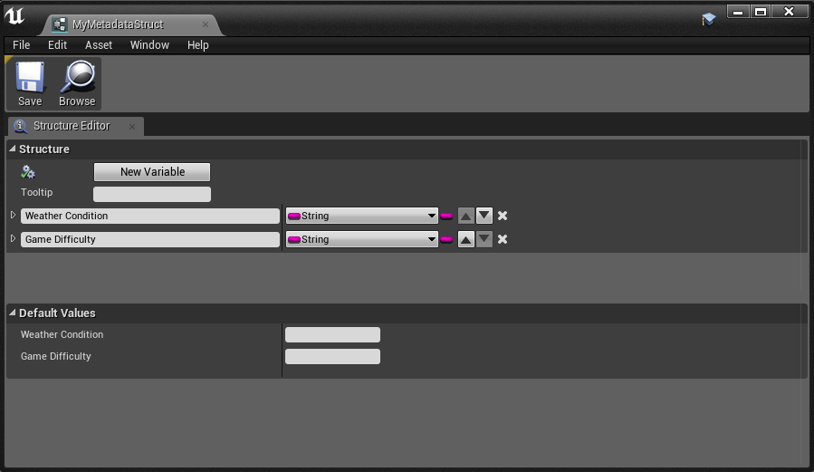
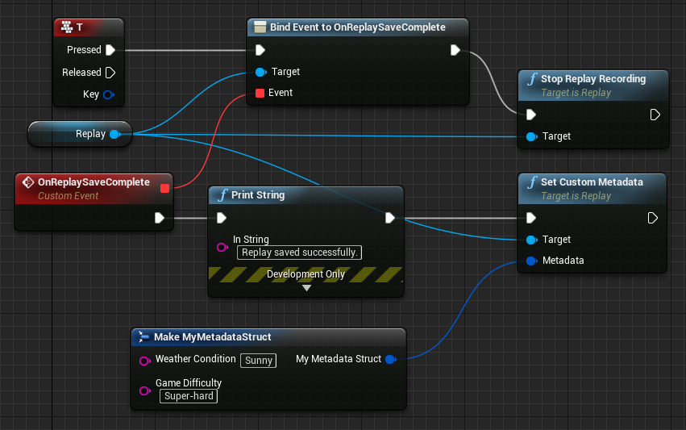
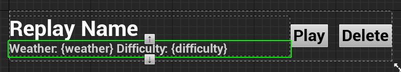
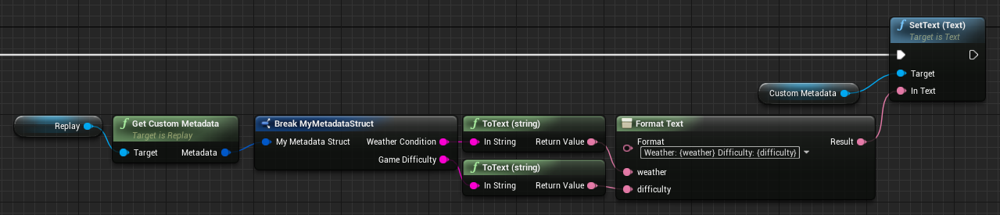
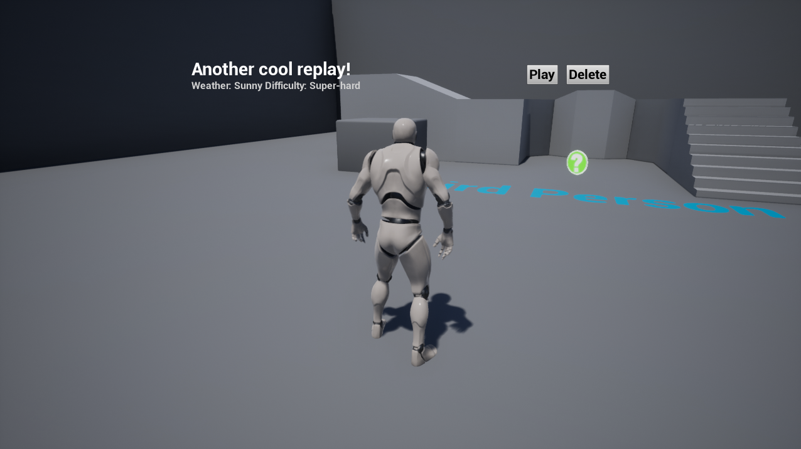

# Using custom metadata

Custom metadata can be used to store general information about a replay for display in e.g. the replay browser. A few examples:

 - Weather conditions
 - Game difficulty
 - Time of day
 - Some game description

...or anything else you can imagine!

Let's create a Blueprint struct which holds the information we want to store:

> 

As you can see, the struct contains two strings: _Weather condition_ and _Game difficulty_. Now we want to use this struct to save the metadata once a recorded replay was saved successfully.

> 

It is simple as that, once the replay saved successfully, where we already had the event for, we set the custom metadata. Originally the _Metadata_ pin was a grey wildcard pin. By just dragging it out and typing _Make MyMetadataStruct_ where that is the name of our struct, it will change it's type and we can fill the struct with data. For the sake of an example, some random values can go here, but you could also fill the struct with real information.

Now let's display this information on our ReplayListEntry widget:

> 

And the event graph for filling that label with data (the following nodes are hooked up to the OnConstruct event):

> 

Great, let us try that out:

> 

As you can see, it works as intended!