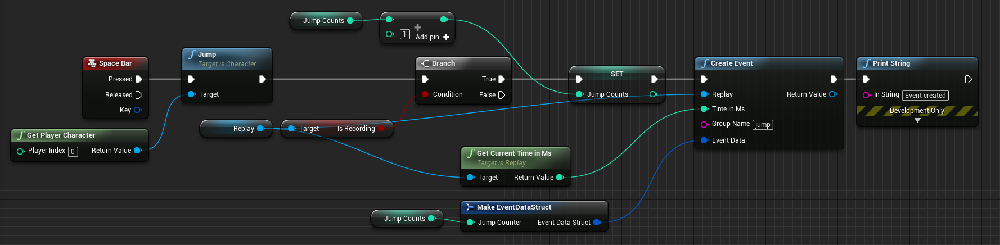
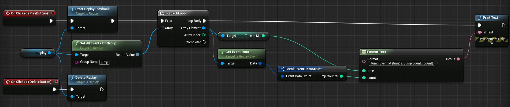
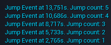

# Using the event system

The event system is a great way to store anything that happened during recording on the replay's timeline, with custom data to it! A few examples would be:

 - A kill the player made
 - A loot crate the player opened

In our example, we will store events when the player jumps, together with a number: a jump counter. Now first, we will go into the level blueprint, because that is the place where we write the events. The graph looks like this:

> 

Looks complicated, but it is fairly easy. First, since we are hooking the Space Bar event, we need to manually tell the character to jump. Then, we check if we are currently recording. No need to write events if we are not. Then, we simply increment an integer counting the jumps. And now comes the cool part: we call the [Create Event](blueprint_api.md#create-event) node on the current replay. _Time in Ms_ is the point in time on the timeline where we want to create this event. Since we jumped _now_, we simply get the current time from the replay and use it as the _Time in Ms_. Next is the group name: every event in the event system is stored with groups to identify the events. In this case, we call it `jump`. The plugin will now create events which are named `jump0`, `jump1`, and so on. As an event data, similar to the custom metadata we dealt with earlier, we connect it to a _Make EventDataStruct_ node, where EventDataStruct is a struct holding the jump counts. That's all for writing events!

Now we want to get all events and print them at playback time. For the sake of this example, we will only print them out once with their timestamps, in a real-world example, you would probably create a timeline widget and draw ticks on that for the events. So let's get to the ReplayListView widget:

> 

As you can see, when we hit play, we get all the stored events on the `jump` group, iterate through them, and print out their time and jump count using the event data. Pretty simple, right?

Let's see that in action:

> <iframe width="560" height="315" src="https://www.youtube.com/embed/Xrvip4JC3DE?rel=0&amp;showinfo=0" frameborder="0" allow="autoplay; encrypted-media" allowfullscreen></iframe>

Since the end is a little bit blurry:

> 

Great, events with their data and their point in time are now correctly displayed! Next, we will learn about the custom replay spectator player controller class.
