# Blueprint API

The **Advanced Replay System** supports a variety of Blueprint nodes which enable you a clean, managed access to your replays.

---

## Interaction

These Blueprint nodes can be used to interact with the replay, which means starting and stopping the recording and playback.

### Start Replay Recording
> 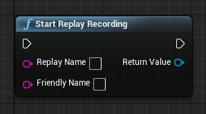   
> This node allows you to start the replay recording. It takes two inputs:   
 - **Replay Name**: This is the internal replay name, which is used for naming the replay files on disk. Players should not see this in your user interface. Example: `replay_desertmap_20170224-204032`
 - **Friendly Name**: This is the user-friendly name. It does not have any impact on the way the replay is recorded, but you should use this to display a replay name to the user. Example: `DesertMap`

> It will return a Replay object instance once fired.

### Stop Replay Recording
> 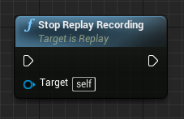   
> This node stops the replay recording, if currently a recording is in progress.  
> **Note**: Once this node is called, it will save the replay to disk, and broadcast the [On Replay Save Complete](#OnReplaySaveComplete) delegate.

### Start Replay Playback
> 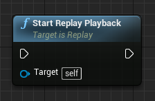   
> Calling this results in the playback of this replay being started. It will **automatically load the map the replay was saved on**, and spawn the [Replay Spectator Player Controller](#ReplaySpectatorPlayerController) for further control.

### Rename Replay
> 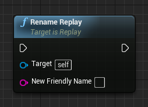   
> Renames a replay. It takes one input:
 - **New Friendly Name**: This is the new friendly name you want to give this replay. Note that the internal replay names cannot be changed as of right now, which might change in a later version

### Delete Replay
> 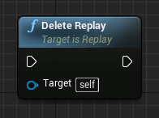   
> Deletes a replay, which removes it completely from disk. You should re-populate your user interface after this so the replay is gone there too.

---

## Utilities

### Get All Replays
> 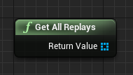   
> Returns an array of replay instances, containing all replays currently saved. You can use this for displaying replays in an user interface.

### Get Replay With Name
> 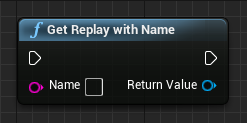   
> This returns a specific replay instance with a certain name. It takes one input:
 - **Name**: The internal name to search and return the replay for

### Get Current Time In Ms
> 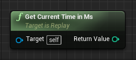   
> If a replay is currently in playback mode, you can use this node to determine the current playback position in millisecond.

---

## Playback Manipulation

### Goto Playback Time
> 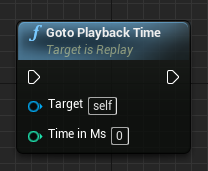   
> If in playback mode, this skips to a given time in milliseconds. It takes one input:
 - **Time in Ms**: The time in milliseconds to skip to.

### Set Pause State
> 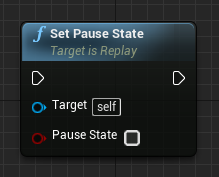   
> If in playback mode, this pauses or unpauses the current playback. It takes one input:
 - **Pause State**: The pause state to apply. Setting this to true will result in the playback being paused, setting it to false will resume it.

### Set Playback Play Rate
> 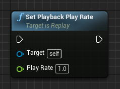   
> If in playback mode, this sets the current play rate (time dilation) of the currently playing replay. It takes one input:
 - **Play Rate**: The new play rate to set. A default value is 1.0, setting it to 2.0 would e.g. play it twice as fast, setting it to 0.5 half as fast.

---

## Metadata

### Get Custom Metadata
> 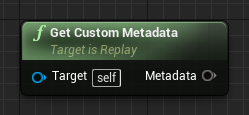   
> This returns the custom metadata stored with this replay.   
> The returned Metadata is a **wildcard** pin, which means that no strict type is defined until you connect it with something.   
> Metadata only supports structs, so to parse the wildcard metadata in a struct of your choice, drag the pin out and search for "Break _your struct name_".

### Set Custom Metadata
> 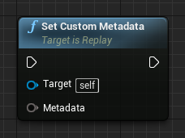   
> Sets new custom metadata for the target replay. As before, this has a **wildcard** pin, which makes it untermined of a strict type until you connect it with something. It takes one input:
 - **Metadata**: The metadata to apply to this replay. To source this from a custom struct of your choice, drag the pin out and search for "Make _your struct name_" or connect an already existing variable of that struct type.

---

## Events

### Create Event
> 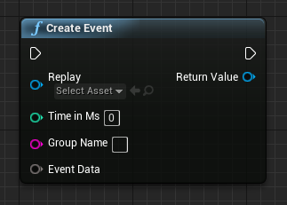   
> Creates a new event with the Replay event system. Notice, the event data is a **wildcard** pin, which means that it's type is undefined until you connect something with it. The procedure is the same as for the [Get Custom Metadata](#get-custom-metadata) and [Set Custom Metadata](#set-custom-metadata) nodes above. You can create events while you record, if you use the [Get Current Time In Ms](#get-current-time-in-ms) node as a given time, the event is created _now_ while recording. It takes three inputs:
 - **Time In Ms**: This is the exact point in time (in milliseconds) where this event should be historicially written down on the replay's timeline.
 - **Group Name**: Events are stored using groups, so you can filter them later on. Example: setting this to `kill` would create events with the following IDs: `kill0`, `kill1`, etc.
 - **Event Data**: Wildcard event data (expecting a struct) with data to save along with this event.

> It will return a Replay event object instance once called.

### Get All Replay Events
> 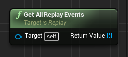   
> Returns all replay events of a given replay. An example use case would be to iterate through the output array, and draw ticks on a timeline respectfully to the events.

### Get Event Data
> 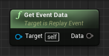   
> This returns the data stored with a replay event.   
> When converting back the data pin to a struct, make sure that you break the data into the same struct as you saved it with.

### Delete Event
> 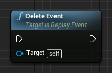   
> Calling this results in the given event being deleted from the replay's timeline.

---

## Member Variables

| Variable Name | Type     | Description |
| ------------- | -------- | ----------- |
| Replay Name   | String   | Internal name of the replay, used for identification |
| Friendly Name | String   | User-friendly name used for user interfaces. Can be changed using [Rename Replay](#rename-replay) |
| Length        | Integer  | The length of the replay in milliseconds |
| File Size     | Integer  | Total file size of the replay in kilobytes |
| Date Recorded | TimeDate | Timestamp of the point in time when this replay was recorded |
| Is Recording  | Boolean  | Indictates if the replay is currently recording |