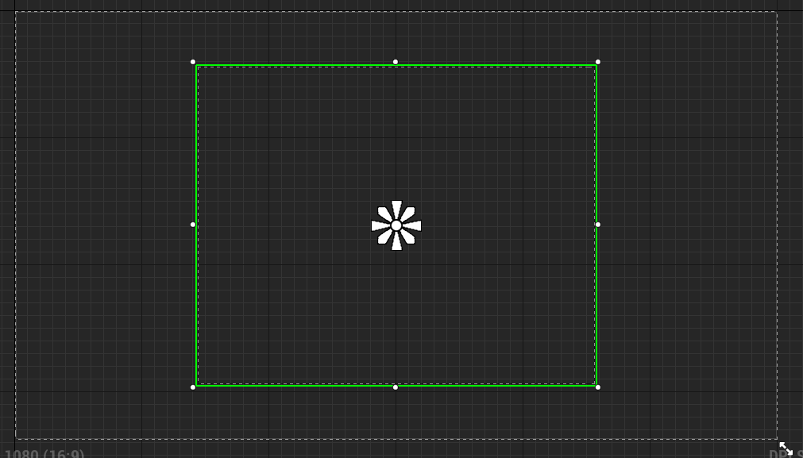
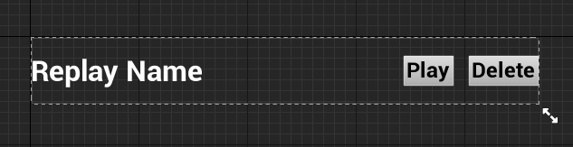
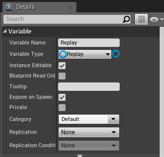
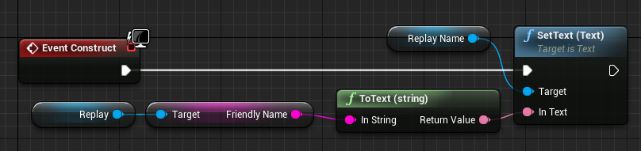
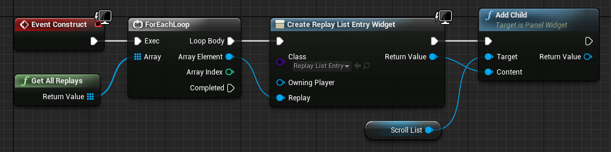
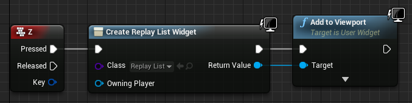
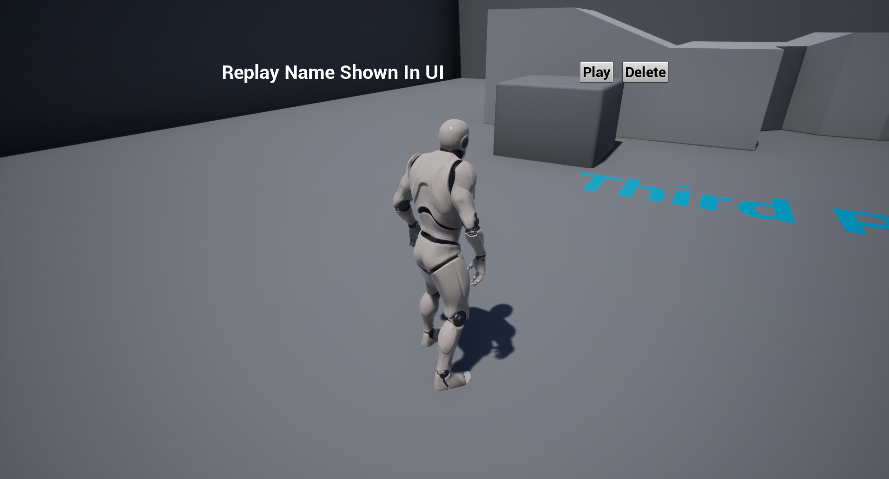

# Listing replays

Now let us create a list of replays. For that, we will create a new Widget Blueprint, with a simple scroll box, like this:

> 

Let's create another Widget Blueprint, this time for the list entries which go into the scroll box. It should look something like this:

> 

Now let's visit the event graph for the list entry widget, and create a new variable called `Replay`, also of type `Replay`. Also make sure that `Instance Editable` and `Expose To Spawn` is checked. It should look like this:

> 

With that, we can create the following event graph:

> 

Now to break this down, on construction of the list entry, the label is set to the value of `Friendly Name` of the current replay

Fine, now let us go back into the replay list event graph, and add the following there:

> 

This is pretty simple:
 - It gets all stored replays
 - Iterates through each of them
 - Creates a list entry widget and sets the replay of the list entry widget to the current iteration (that is why we checked `Expose To Spawn`)
 - Add the list entry widget to the scroll box.

Now let's just render that widget to screen in the level blueprint when pressing Z:

> 

Great, how does that look in game?

> 

Awesome, exactly how we want it. Read in the next part how to integrate the playback functionality.
