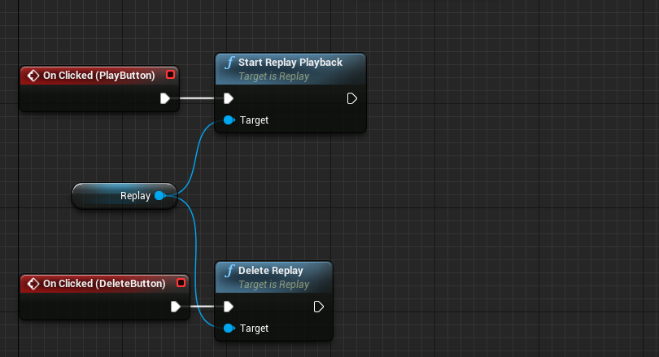

# Playing back replays

Now that we have a functioning list, we only need to playback replays. In our replay list entry widget's event graph, simply add the following code:

> 

This simply initiates the replay's playback when clicking the play button, and deletes it when clicking the delete button - it is simple as that!

Now this will have one major flaw, when deleting the replay with that button, the list entry will still be in the list, since we are not telling the list to redraw. We would need to work with Unreal's event dispatchers here, but for the sake of this tutorial, I will leave that out. See the example project for more details on that.

Now with this included, we can finally test if everything does work, and it does:

> <iframe width="560" height="315" src="https://www.youtube.com/embed/buURmZTZudI?rel=0&amp;showinfo=0" frameborder="0" allow="autoplay; encrypted-media" allowfullscreen></iframe>

Now we covered the three major features of this system: **recording**, **listing** and **playing back** replays. In the next tutorial, read on how we can use custom metadata with our replays.