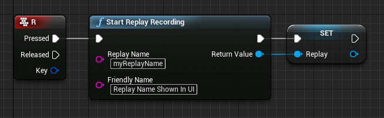
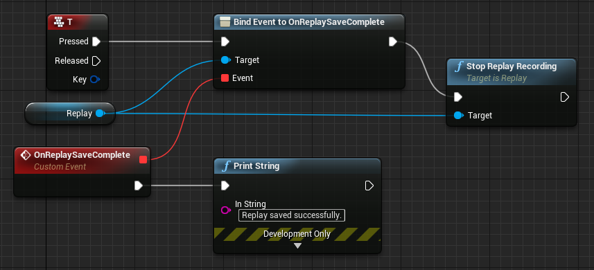

# Recording and playing back Replays

The most basic feature of what the **Advanced Replay System** can provide is record and playback replays.

---

So first, let's record a new replay when pressing the key R in the level blueprint:

> 

Now, when the player presses R, a new replay with the internal name `myReplayName` and the friendly name `Replay Name Shown In UI` is created and the recording started. Let's stop the recording again when the player presses the T key:

> 

When the player presses the T key, we first bind a new event to the [On Replay Save Complete](#on-replay-save-complete) delegate, so we can notify our player that the replay was saved successfully. After that, we stop the replay recording. Once the system saved the replay to disk, the event, and the connected Print String gets called.

A little demo on how it looks:

> <iframe width="560" height="315" src="https://www.youtube.com/embed/WnR2jYYndLc?rel=0&amp;showinfo=0" frameborder="0" allow="autoplay; encrypted-media" allowfullscreen></iframe>

As you can see, the replay gets recorded, and when the recording finishes, the Print String can be seen, and the replay folder is created in the background.
