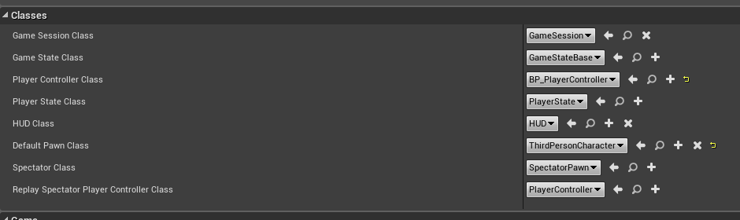
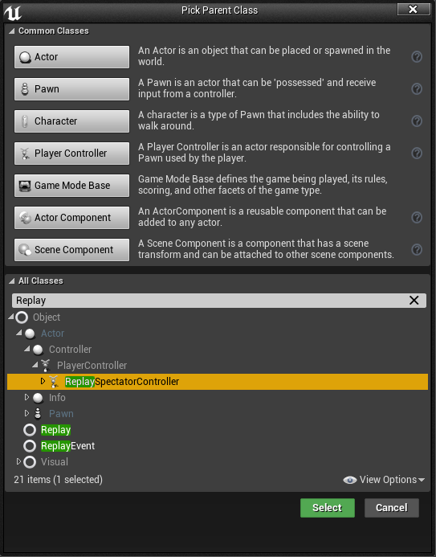
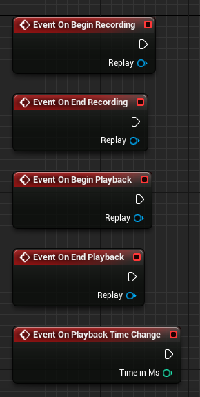
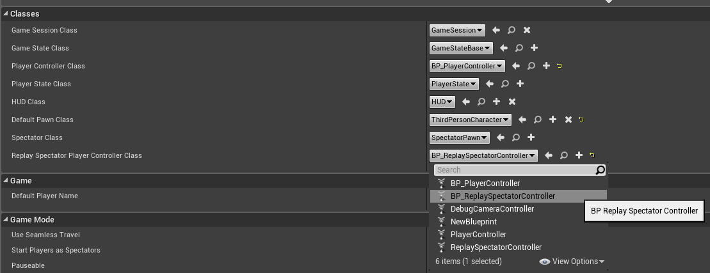

# Replay Spectator Player Controller API

The **Advanced Replay System** implements a new Player Controller class which should be used as the Replay Spectator defined in the Game Mode.

So, first let's create a new Game Mode for our example project, and set the defaults according to our project:

> 

What we are about to change is the _Replay Spectator Player Controller Class_, so we need to create one first. Create a new blueprint deriving of the ReplaySpectatorController class:

> 

Now, in that player controller class, you have access to the following events:

> 

Example uses for that would be to create a timeline widget once playback starts, destroy it when the playback stops, and create a recording overlay with the current time when the recording starts. Also, with this, you can interact with the replayed world, since this is just a player controller in a world - just as it would be "live". So in here you could iterate through all actors of a character class and display a player list of players which were recorded during the replay.

That newly created player controller now only needs to be set in the game mode:

> 

This was the end of the little tutorial section, right now you should have learned all basics to use the plugin, but you can always check out the [Blueprint API](blueprint_api.md) tab for an in-depth guide for every node in the plugin.